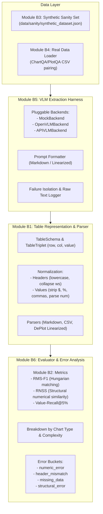

# Chart-to-Table: Modular Pipeline Architecture (Modules B1–B6)

[](https://www.python.org/)
[](LICENSE)
[](https://docs.pydantic.dev/)

A clean, modular repository implementing **Stage 1 (Chart-to-Table)** extraction, canonical table modeling, and evaluation metrics across Modules B1 to B6.

---

## Architecture & Module Boundaries (B1–B6)



---

## Module Breakdown

| Module | Location | Responsibilities & Implementations |
|---|---|---|
| **B1** | `src/format/` | **Table Representation & Parsers**: `TableTriplet` (row, col, value) and `TableSchema`. Header normalization (lowercase, collapse whitespace), cell value normalization (currency/comma/percent stripping and numeric coercion), markdown codeblock stripping, and parsers for Markdown, CSV, and Linearized DePlot formats. |
| **B2** | `src/metrics/` | **Metrics**: Mathematical formulations for `RMS-F1` (Normalized Levenshtein header matching with threshold $\tau = 0.5$, relative value distance $D = \min(1, |p - t| / |t|)$, Hungarian matching assignment via `scipy.optimize.linear_sum_assignment`), `RNSS` (structural numerical similarity), and `Value-Recall@5%`. |
| **B3** | `data/sanity/`, `src/data_loader/synthetic.py` | **Synthetic Sanity Set**: 6 diverse mock chart metadata and ground-truth tables (bar, line, grouped bar, horizontal bar, mixed complexity). |
| **B4** | `src/data_loader/loader.py` | **Real Data Loader**: Ingestion layer pairing image paths with gold CSV files (ChartQA / PlotQA format), converting CSV into Module B1 canonical tables with missing-file error logging. |
| **B5** | `src/models/harness.py` | **VLM Extraction Harness**: Pluggable backend architecture (`MockBackend`, `OpenVLMBackend`, `APIVLMBackend`), extraction prompt formatter, and isolated execution saving raw text and recording `parse_ok`. |
| **B6** | `src/evaluation/evaluator.py` | **Evaluation & Error Analysis**: Evaluates extraction against gold tables, computes aggregations broken down by chart type and complexity, and categorizes failures into actionable error buckets (`numeric_error`, `header_mismatch`, `missing_data`, `structural_error`). |

---

## Directory Layout

```
chart-to-table/
├── configs/
│   └── config.yaml              # Declarative experiment configuration
├── data/
│   ├── raw/                     # Benchmark datasets (ChartQA, PlotQA)
│   └── sanity/
│       ├── sample_table.json    # Single sample fixture
│       └── synthetic_dataset.json # Module B3: 6 synthetic chart fixtures
├── src/
│   ├── format/                  # [Module B1] Table representations & parsers
│   │   ├── __init__.py
│   │   ├── parser.py            # Normalizers, codeblock strippers, format parsers
│   │   └── schema.py            # TableTriplet, TableSchema
│   ├── metrics/                 # [Module B2] Evaluation metrics
│   │   ├── __init__.py
│   │   └── table_metrics.py     # RMS-F1 (Hungarian), RNSS, Value-Recall@5%
│   ├── data_loader/             # [Modules B3 & B4] Data ingestion
│   │   ├── __init__.py
│   │   ├── loader.py            # Real ChartQA/PlotQA loader
│   │   └── synthetic.py         # Synthetic benchmark loader
│   ├── models/                  # [Module B5] Extraction harnesses
│   │   ├── __init__.py
│   │   ├── deplot.py            # Minimal DePlot stub
│   │   └── harness.py           # Pluggable VLMTableHarness (Mock, Open, API)
│   └── evaluation/              # [Module B6] Evaluation & error analysis
│       ├── __init__.py
│       └── evaluator.py         # PipelineEvaluator & categorize_error
├── tests/
│   ├── __init__.py
│   └── test_pipeline.py         # 10 unit tests covering Modules B1 to B6
├── .gitignore
├── requirements.txt             # Lightweight dependencies
├── main.py                      # End-to-end smoke test script
└── README.md                    # Project documentation
```

---

## Execution & Verification

### 1. Run Smoke Test
```bash
python main.py
```
Executes an end-to-end smoke run: loads Module B3 synthetic data, extracts via Module B5 MockBackend, parses via Module B1, evaluates with Module B2 metrics, and produces Module B6 breakdowns by chart type, complexity, and error categories.

### 2. Run Test Suite
```bash
pytest tests/ -v
```
All 10 unit tests pass across parsers, normalization rules, metric calculations, synthetic datasets, and evaluator error categorization.
