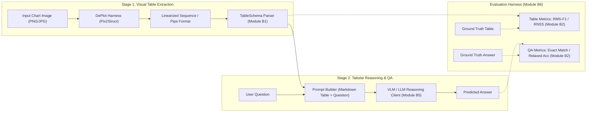

# Chart-to-Table $\rightarrow$ Table QA: Two-Stage Multimodal Pipeline

[](https://www.python.org/)
[](LICENSE)
[](https://pytorch.org/)
[](https://huggingface.co/google/deplot)

An academic, modular framework for evaluating two-stage multimodal Chart Question Answering (ChartQA / PlotQA). Rather than relying on monolithic end-to-end Vision-Language Models (VLMs) that often suffer from numerical hallucination on complex data visualizations, this repository structures the task into two decoupled, interpretable stages:
1. **Stage 1 (Chart-to-Table):** Translating visual charts into structured tabular representations using visual document models (e.g., Google's [DePlot](https://huggingface.co/google/deplot) / Pix2Struct).
2. **Stage 2 (Table QA):** Answering natural language questions conditioned on the extracted table using language reasoning models (VLMs / LLMs).

---

## Architecture Pipeline



---

## Directory Layout

```
.
├── configs/
│   └── config.yaml              # Declarative experiment and model configurations
├── data/
│   ├── raw/                     # Benchmark datasets (ChartQA, PlotQA)
│   └── sanity/                  # Minimal fixtures for offline smoke testing & CI
│       └── sample_table.json    # Sample table and QA fixture
├── src/
│   ├── format/                  # [Module B1] Common table schema and serialization
│   │   ├── __init__.py
│   │   └── schema.py            # TableSchema (Pydantic / dataclass, Markdown, DataFrame)
│   ├── metrics/                 # [Module B2] Evaluation metrics
│   │   ├── __init__.py
│   │   └── table_metrics.py     # RMS-F1, RNSS, Relaxed QA Accuracy
│   ├── data_loader/             # [Module B4] Dataset ingestion stubs
│   │   ├── __init__.py
│   │   └── loader.py            # ChartDataLoader, ChartDatasetItem
│   ├── models/                  # [Module B5] Inference harnesses
│   │   ├── __init__.py
│   │   ├── deplot.py            # Google DePlot (Pix2Struct) visual table extractor
│   │   └── vlm_client.py        # VLM/LLM tabular reasoning client
│   └── evaluation/              # [Module B6] Evaluation orchestration
│       ├── __init__.py
│       └── evaluator.py         # End-to-end two-stage PipelineEvaluator
├── tests/
│   ├── __init__.py
│   └── test_pipeline.py         # Pytest unit tests for all modules
├── .gitignore                   # Ignores caches, checkpoints, raw data, IDE files
├── requirements.txt             # Core dependencies
├── main.py                      # Runnable sanity demonstration entry script
└── README.md                    # Project documentation
```

---

## Module Boundaries (B1 – B6)

Each component has clear interfaces and strict functional boundaries:

| Module | Subpackage | Key Class / Functions | Responsibility |
|---|---|---|---|
| **B1** | `src.format` | `TableSchema` | Canonical data structure for extracted and ground-truth tables. Handles shape validation, dictionary export, pandas `DataFrame` conversion, Markdown rendering, and DePlot linearized text round-trips. |
| **B2** | `src.metrics` | `compute_rms_f1`, `compute_rnss`, `compute_relaxed_accuracy`, `compute_qa_accuracy` | Mathematical metrics evaluating: (1) cell-level numerical extraction accuracy ($\text{RMS-F1}$ within 5% tolerance), (2) matrix structural similarity ($\text{RNSS}$), and (3) QA prediction fidelity. |
| **B4** | `src.data_loader` | `ChartDataLoader`, `ChartDatasetItem` | Ingestion layer abstracting ChartQA, PlotQA, and local sanity datasets. Delivers standard sample objects containing chart paths, questions, and ground-truth tables. |
| **B5** | `src.models` | `DePlotHarness`, `VLMClient` | Stage 1 inference wrapper around `google/deplot` (Pix2Struct) and Stage 2 reasoning harness querying LLMs/VLMs with structured table contexts. |
| **B6** | `src.evaluation`| `PipelineEvaluator` | Pipeline orchestrator executing both stages per sample, computing cell extraction metrics and QA metrics, and aggregating benchmark summaries. |

---

## Metric Definitions

### 1. RMS-F1 (Relative Mean Squared Error F1)
Measures cell-level numerical extraction fidelity. A predicted numerical cell $\hat{y}$ is counted as a **True Positive** ($TP$) against ground truth $y$ if:
$$\frac{|\hat{y} - y|}{\max(|y|, \epsilon)} \le \tau \quad (\text{typically } \tau = 0.05 \text{ or } 5\%)$$
From which standard cell precision, recall, and harmonic mean $F_1$ are computed.

### 2. RNSS (Relative Numerical Structural Similarity)
Blends cell numerical precision ($F_1$) with column alignment Jaccard similarity:
$$\text{RNSS} = \frac{1}{2} F_1 + \frac{1}{2} \mathcal{J}(\text{Cols}_{\text{pred}}, \text{Cols}_{\text{gt}})$$

### 3. Relaxed Accuracy (ChartQA Standard)
For numerical targets, predictions within $5\%$ relative error are scored as correct ($1.0$). Non-numerical targets are evaluated via normalized exact string match.

---

## Environment Setup

### 1. Prerequisites
- Python 3.10+
- Recommended: CUDA 11.8+ / 12.0+ for GPU-accelerated DePlot inference.

### 2. Virtual Environment Creation
```bash
# Clone or navigate to the repository
cd chart-to-table

# Create virtual environment
python -m venv .venv

# Activate virtual environment
# Windows (PowerShell):
.venv\Scripts\Activate.ps1
# Linux / macOS:
# source .venv/bin/activate
```

### 3. Install Dependencies
```bash
pip install --upgrade pip
pip install -r requirements.txt
```

---

## Run Instructions

### 1. Sanity Check Run
To test the entire pipeline end-to-end using local mock fixtures without downloading multi-gigabyte model weights:
```bash
python main.py
```
**Expected Output:**
- Loads `data/sanity/sample_table.json`.
- Validates `TableSchema` dimensions and structure.
- Displays Markdown table, converted pandas DataFrame, and linearized text.
- Executes `PipelineEvaluator` and prints an evaluation summary JSON.

### 2. Run Test Suite
Run the automated unit tests across all modules:
```bash
python -m pytest tests/ -v
```

### 3. Configuration Customization
Adjust pipeline hyperparameters in `configs/config.yaml`:
```yaml
deplot:
  model_name_or_path: "google/deplot"
  device: "cuda"  # Switch between "cuda" and "cpu"
  max_new_tokens: 512

table_qa:
  model_provider: "vlm_stub"  # "openai", "vlm_stub", "huggingface"
  model_name: "gpt-4o-mini"
  temperature: 0.0
```
